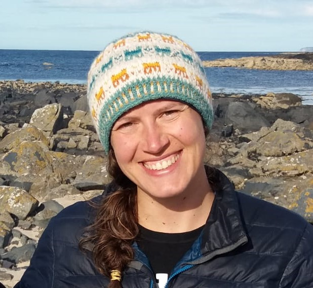
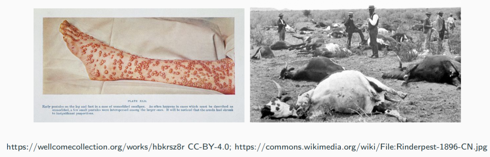
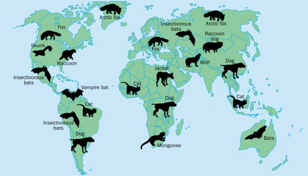
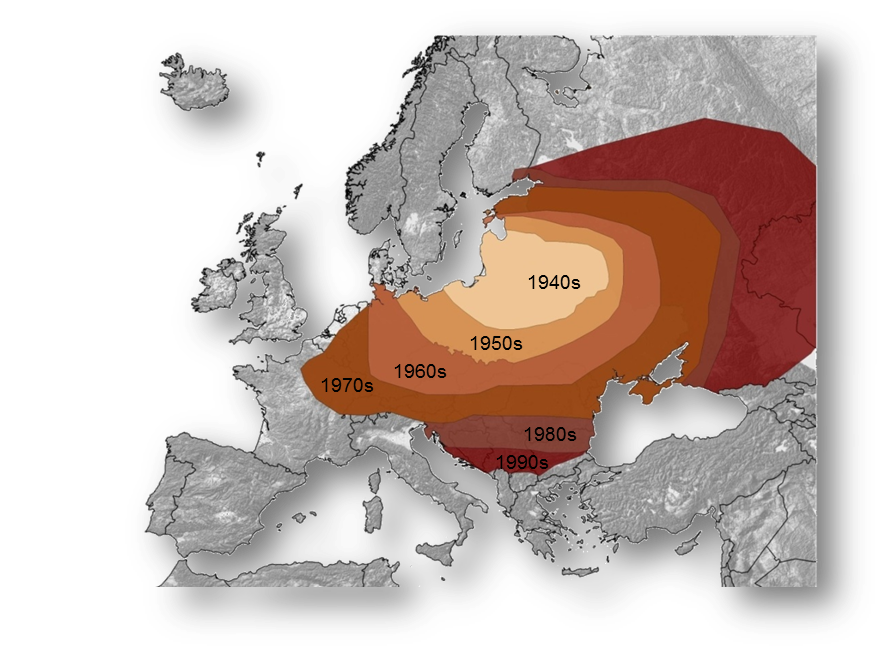
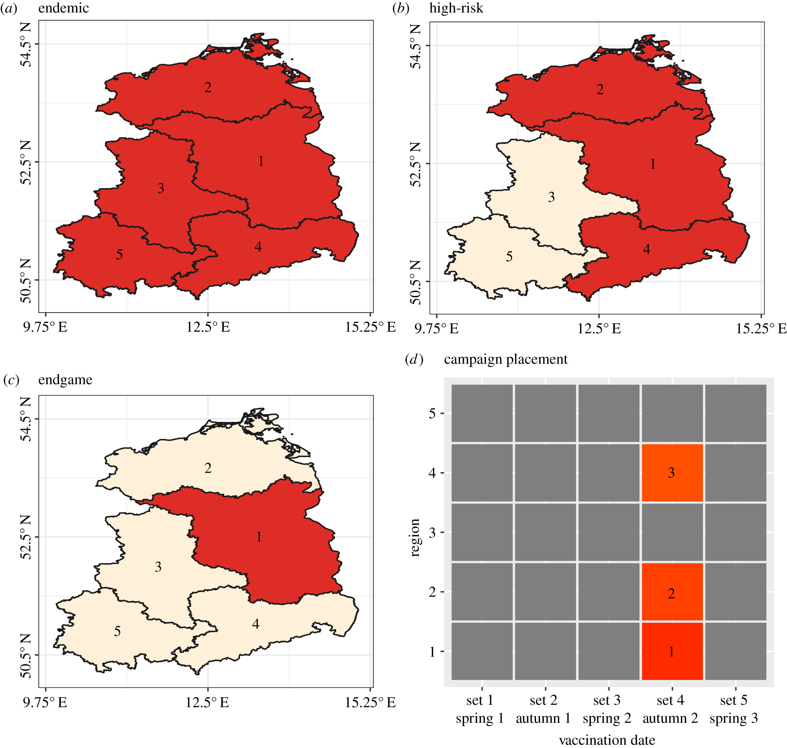
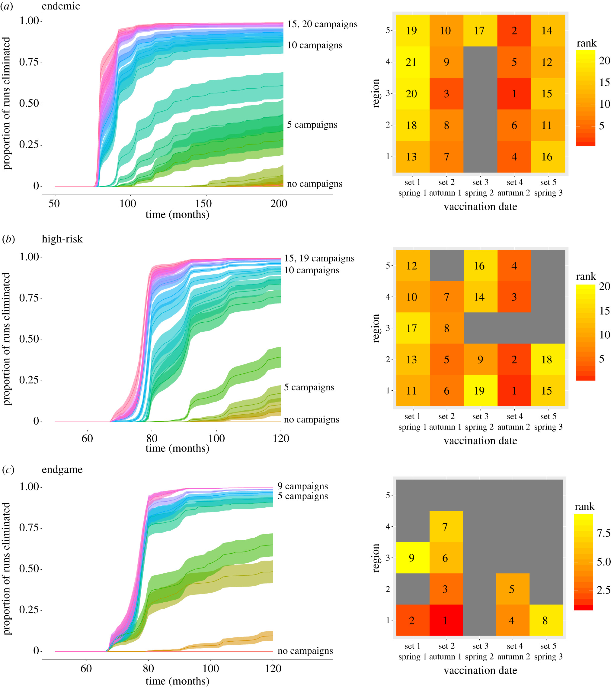
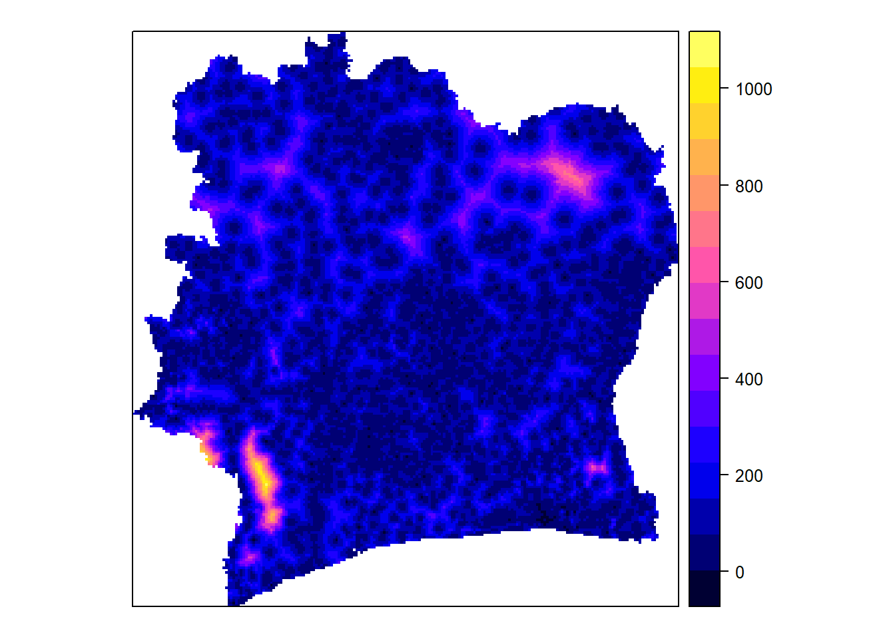
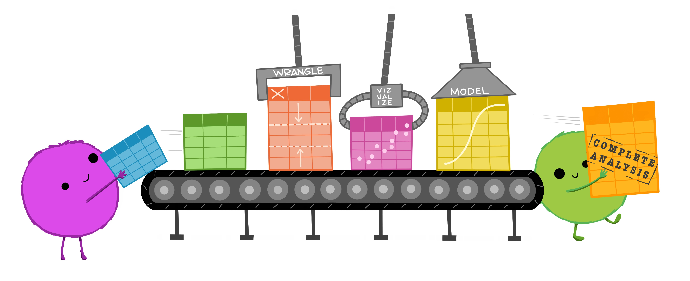
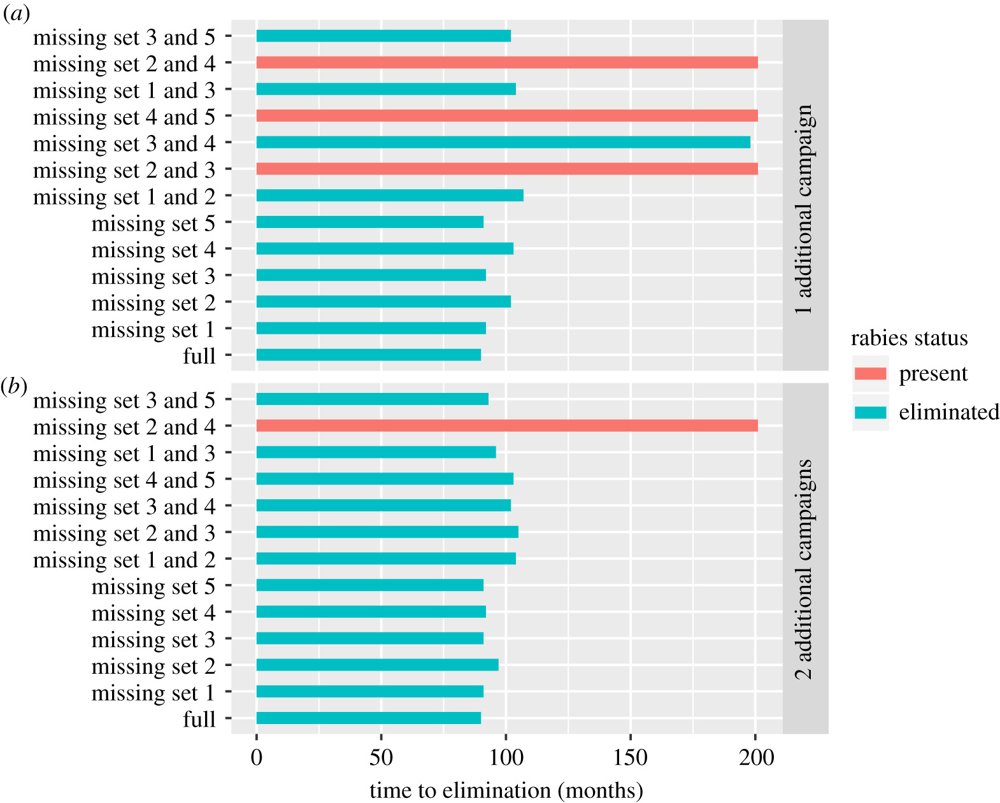

```{r libraries, results='hide', message = FALSE, echo = FALSE,  warning = FALSE}

#install.packages("tidyverse")
#install.packages("readxl")
#devtools::install_github("gadenbuie/xaringanExtra")
#install.packages("fontawesome")


library(dplyr)
library(leaflet)
library(readxl)
library(xaringanExtra)
library(fontawesome)
library(icons)
library(DT)
library(htmltools)
library(htmlwidgets)

knitr::opts_chunk$set(message=FALSE, warning=FALSE, hiline=TRUE)


xaringanExtra::use_xaringan_extra(include = c("panelset", "tile_view", "share_again", "use_broadcast"))

xaringanExtra::style_share_again(share_buttons = c("twitter", "linkedin", "pocket"))


```


background-image: url(images/rabies_retreat.png)
background-position: top right
background-size: contain
class: middle, left

# `r rmarkdown::metadata$title`

## `r rmarkdown::metadata$author`


### `r rmarkdown::metadata$date`


.footnote[Map courtesy of the Friedrich Loeffler Institut]

---
class: middle, left

# About me

.pull-left[

.center[


## Laurie Baker

### Head of Faculty

Data Science Campus, <br> Office for National Statistics
]]
.pull-right[
### Education

`r icons::fontawesome("globe")` Wabanaki lands in Yarmouth, ME.

`r icons::fontawesome("graduation-cap")` BSc Marine Biology, University of St. Andrews
`r icons::fontawesome("graduation-cap")` Msc Marine Biology, Dalhousie University
`r icons::fontawesome("graduation-cap")` PhD Epidemiology, University of Glasgow


### Research Interests

`r icons::fontawesome("syringe")`  Public Health
`r icons::fontawesome("fish")`  Ecology
`r icons::fontawesome("desktop")` Data Science
`r icons::fontawesome("satellite")` Novel Data Sources

]

.center[
[`r icons::fontawesome("link")` lauriebaker.rbind.io](https://lauriebaker.rbind.io)
[`r icons::fontawesome("twitter")` @llbaker1707](https://twitter.com/llbaker1707)
[`r icons::icon_style(icons::fontawesome("github"), scale = 1)` @laurielbaker](https://github.com/laurielbaker)
]
???

# About Me

* Grew up in Yarmouth, Maine.

* BSc. in Marine Biology at the University of St. Andrews, Scotland

* MSc. in Marine Biology at Dalhousie University, Canada

* PhD. in Epidemiology at University of Glasgow, Scotland

* Head of Faculty, Data Science Campus, Office for National Statistics


???

About me.
---
# Background

* Only two diseases have been eliminated worldwide: small pox and rinderpest.


```{r, echo=FALSE, out.width=1050, fig.align='center', fig.cap="Patient's leg with small pox. Cattle that have died from rinderpest"}



```


--
* Mass vaccination can reduce the burden of vaccine-preventable diseases.

--

* How long does a vaccination programs need to run to eliminate a disease?

--
* Explore vaccination strategies applied to fox rabies and Covid-19

???
- Only two infectious diseases have been eliminated worldwide: small pox and rinderpest.

- Mass vaccination can greatly reduce the burden of vaccine-preventable diseases. 

- However, it is unclear how long vaccination programs must operate to eliminate infection. 

- In this talk I am going to explore two different vaccination strategies applied to fox rabies and Covid-19.
---
class: inverse, center, middle
# Wildlife vaccination planning

???

The first example is an example of wildlife vaccination planning. 

---
# Rabies

* Rabies is a deadly disease that kills over 59,000 people each year.
* An RNA virus that causes encephalitis in a large range of mammals.

```{r, echo=FALSE, out.width=750, fig.align='center', fig.cap="Map of the world with main rabies animal hosts pictured."}



```

.footnote[Rupprecht CE, Hanlon CA, Hemachudha T. Rabies re-examined. Lancet Infect Dis. 2002 Jun;2(6):327-43. doi: 10.1016/s1473-3099(02)00287-6. PMID: 12144896.]

???

* Rabies is a deadly disease that kills over 59,000 people each year, with many millions more requiring expensive life-saving vaccines.
* Rabies is an RNA lyssavirus that causes encephalitis in a large range of mammals. 
* This map shows the primary reservoirs (that is the hosts that perpetuate this disease).
* The main reservoir in Europe is the red fox.


---
# Foxes

* Most widespread terrestrial carnivore in Europe

* Territorial with high population turnover 
  * Most foxes live up to 4 years. 
  * Large birth pulse in spring where the population doubles. 


```{r, echo=FALSE, out.width=750, fig.align='center', fig.cap="Rabies cycle in foxes."}

knitr::include_graphics("images/fox_rabies_timeline.png")

```

.footnote[Figure courtesy of the Friedrich Loeffler Institut]
???

* Most widespread terrestrial carnivore in Europe
* Territorial with high population turnover 
  * Most foxes live on average 4 years. 
  * Large birth pulse in Spring where the population doubles. 

---
# Spread of Rabies in Foxes

.left-column[
```{r, echo=FALSE, out.width=820, fig.align='center', fig.cap="Tidy Data."}



```


.footnote[Figure courtesy of the Friedrich Loeffler Institut]

]
.right-column[


]

* **1940s:** Spillover from dogs to foxes

--

* **1950s-1970s:** Rapid spread throughout Europe

--

* **Late 1970s:** Veterinarians facing major health crisis

--

`r icons::fontawesome("pizza-slice")` Lunch Warning: Next Slide


---
# Vaccine Deployment

AKA ["That Time Europe Air-dropped Vaccine-loaded Chicken Heads to Bait Rabid Foxes"](https://www.theatlantic.com/science/archive/2015/12/that-time-europe-air-dropped-vaccine-loaded-chicken-heads-to-bait-rabid-foxes/417951/)


.left-column[
```{r, echo=FALSE, out.height=510, out.width = 660, fig.align='center', fig.cap="Animation showing distribution of vaccines."}

knitr::include_graphics("images/western_europe_vac_cases_oct_2016.gif")

```


.footnote[Images: Friedrich Loeffler Institut]
]

.right-column[
<br>

```{r, echo=FALSE, out.width=240, fig.align='center', fig.cap="Figure 1. Vaccine-loaded chicken heads. Figure 2. Fixed wing aircraft used to distribute vaccines."}

knitr::include_graphics(c("images/chicken_head.jpg", "images/fixed_wing_hungary.jpg"))


```


`r icons::fontawesome("syringe")` At least they didn't go with the spring-loaded needle traps!


]


???

Over three decades, vaccine loaded chicken-heads were air-dropped across Europe covering a total of 2.36 million square kilometers, the equivalent of 550,000 soccer fields. 

---
# Study

.left-column[
```{r, echo=FALSE, out.width=510, fig.align='center', fig.cap="Incidence Ratio"}




```
]
.right-column[

.center[

### Simulated rabies cases to explore:

`r icons::icon_style(icons::fontawesome("globe"), scale = 2)`

### Where and when?


`r icons::icon_style(icons::fontawesome("money-bill-alt"), scale = 2)`


### How many to achieve elimination?

]
]

.footnote[
[**Baker LL**, Matthiopoulos J, Müller T, Freuling C, Hampson K (2019). Optimizing
spatial and seasonal deployment of vaccination campaigns to eliminate wildlife
rabies. **Phil. Trans. R. Soc. B.** 374.](https://royalsocietypublishing.org/doi/10.1098/rstb.2018.0280)]

---
# Where and When


.left-column[


```{r, echo=FALSE, out.width=500, fig.align='center', fig.cap="Time to elimination for missed vaccination campaign sets."}




```

]

.right-column[

.center[
`r icons::icon_style(icons::fontawesome("money-bill-alt"), scale = 2)`


### Similar effort in high-risk and endemic 

`r icons::icon_style(icons::fontawesome("clock"), scale = 2)`

### Autumn campaigns = greatest reductions

`r icons::icon_style(icons::fontawesome("money-bill-alt"), scale = 2)`

### Vaccination needed in rabies-free regions

]
]

???

This figure shows the probability of elimination and ranked importance of campaigns across epidemiological scenarios. Left panels show the probability of elimination from all five regions in response to incremental vaccination (mean, and shaded 95% CI). (a) In the endemic scenario, 21 campaigns were required to eliminate rabies from all regions. (b) In the high-risk scenario, 19 campaigns were required to eliminate rabies from all regions, with vaccination of the endemic regions ranked first, and vaccination after the birth pulse (months 56 and 68) contributing most to the probability of elimination. A minimum of two or three campaigns was required in neighbouring rabies-free regions. (c) In the endgame scenario, nine campaigns were required to eliminate rabies from all regions.


What we can see from these results is that:

1. Similar effort is required in high-risk and endemic, even though fewer regions were initially infected. 


2. Autumn campaigns were ranked highest and resulted in the greatest reductions in rabies because they come after the birth pulse. 

3. Vaccination needed in rabies-free regions. Because rabies moves across borders, vaccination is still required in neighbouring regions. 


---
# Time to Control and Elimination

.left-column[

```{r, echo=FALSE, out.width=850, fig.align='center', fig.cap="Incidence Ratio of Rabies over time in response to vaccination"}

knitr::include_graphics("images/incidence_ratio.jpg")


```
]

.right-column[

.center[

## Susceptible Population

<br>

### `r icons::icon_style(icons::fontawesome("arrow-up"), scale = 1)` Birth pulse

### `r icons::icon_style(icons::fontawesome("arrow-down"), scale = 1)` Vaccination
]

]
.footnote[
**Baker LL**, Matthiopoulos J, Mul̈ler T, Freuling C, Hampson K (2019). Optimizing
spatial and seasonal deployment of vaccination campaigns to eliminate wildlife
rabies. **Phil. Trans. R. Soc. B.** 374.]

???
* Consecutive vaccination campaign sets build up and sustain high levels of herd immunity


---
class: center
# Take Home


--
.center[
`r icons::icon_style(icons::fontawesome("globe"), scale = 2)`

### 1. Diseases like rabies do not respect borders
]

--

.center[
`r icons::icon_style(icons::fontawesome("hands-helping"), scale = 2)`

### 2. Coordinated effort is required to control and eliminate rabies
]


--

`r icons::icon_style(icons::fontawesome("paw"), scale = 2)`

.center[
### 3. Know your species
]

---
class: inverse, center, middle
# Covid-19 Vaccination Planning

---

# Vaccination Sites in Lewiston Auburn

```{r vaccines, eval = TRUE, echo = FALSE}

vac_loc <- read_xlsx("../data/LA_vaccination_locations.xlsx")


DT::datatable(vac_loc, 
              options = list(
                paging = TRUE,
                pageLength =  5 
                           ),
              height = 500
              )
```

**Source:** [www.maine.gov/covid19/vaccines/vaccination-sites](https://www.maine.gov/covid19/vaccines/vaccination-sites)
???

---
# Vaccination Bates

`r fontawesome(name = "question-circle")` What might influence someone's decision of where to get vaccinated?

```{r, echo = FALSE}
iconset1 <- awesomeIconList(
   "Pharmacy" = makeAwesomeIcon(markerColor = "orange"),
   "Health Care Center" = makeAwesomeIcon(markerColor = "blue"),
   "Mobile Vaccination Unit" = makeAwesomeIcon(markerColor = "red")
)

labels <- sprintf(
  "<strong>%s</strong><br/>Public OR Patients Only: %s<br/>Vaccinates ages 16 and 17+: %s",
  vac_loc$Name, vac_loc$`Public OR Patients Only`, vac_loc$`Vaccinates ages 16 and 17+`
) %>% lapply(htmltools::HTML)

```


```{r first-leaflet-map1f, eval = TRUE, echo = FALSE, out.width = 1000}
leaflet(data = vac_loc) %>%
  setView(lng = -70.2022, 
          lat = 44.1057, 
          zoom = 14) %>%
  addProviderTiles(providers$OpenStreetMap) %>%
  addAwesomeMarkers(~Longitude, 
                    ~Latitude, 
                    icon = ~iconset1[as.factor(Type)],
                    popup = ~labels)
```


---
# Role of Open Data

<iframe src="https://andysouth.shinyapps.io/healthsites_viewer/" width="1016" height="516" frameBorder="0"></iframe>

[Healthsites Viewer](https://andysouth.shinyapps.io/healthsites_viewer/)
???

Open and up-to-date data is crucial to plan these efforts. With afrimapr we've been working closely with healthsites.io and other open mapping efforts to gather and visualise the data that is needed.

---
# How do we define accessibility?

.left-column[

```{r, echo=FALSE, out.width=650, fig.align='center', fig.cap="Map of Côte d'Ivoire showing estimated travel time walking."}



```

### Health Accessibility, Côte d'Ivoire
Travel time in minutes walking to local health centers
]

.right-column[

]

--

## Financial barriers?

--

## Organisational barriers?

--

## Social and Cultural barriers?

???
Remote sensing and other open data sets can help to approximate health accessibility in a "physical sense". 

But if we define accessibility only in terms of physical distances, what are we missing?

The extent to which a population 'gains access' also depends on financial, organisational and social or cultural barriers that limit the use of services.


The people who are best placed to answer these questions and devise a strategy are the communities and healthworkers with local knowledge who are closest to the issues and the community.

---
# Afrimapr tutorials

<iframe src="https://andysouth.shinyapps.io/intro-to-spatial-r/" width="1016" height="516" frameBorder="0"></iframe>

Sign up for the [Afrimapr Tutorials](https://andysouth.shinyapps.io/intro-to-spatial-r/) and others at the [UseR! 2021 conference](https://www.conftool.org/user2021/index.php?page=browseSessions&form_session=3)

???

With Afrimapr I am helping to develop spatial tutorials to equip communities with the tools to engage in data science work so that they may address issues of local and/or ecocultural importance. This includes tutorials on how to visualise spatial data and where to access key health and environmental information.


---
class: center
# Take Home

### Computer science can provide us with the tools


```{r, echo=FALSE, out.width=620, fig.align='center', fig.cap="Data Analysis assembly line: Wrangle, Visualise, Model"}



```


.footnote[Artwork by @allison_horst]

--

### But we bring the

--

----


.right-col[.center[
`r icons::icon_style(icons::fontawesome("lightbulb", style = "solid"), scale = 2)`
### Knowledge
]]

--

.left-col[.center[
`r icons::icon_style(icons::fontawesome("globe"), scale = 2)`
### Context
]]

--

.center-col[
.center[
`r icons::icon_style(icons::fontawesome("users"), scale = 2)`
### Experience

]]


???


Computer science and data science can provide us with the tools to tackle complex issues. But we bring the knowledge, the context, and importantly the human experience and perspectives to make our work meaningful and equitable. 

Data is always a simplification of the human experience and it is important that in our data science projects we ask the questions like those set out by Catherine D'Ingazio and Lauren Klein: "Data Science By Whom"? "Data Science For Whom?"?, "Data Science with whose interests in mind?" 

We also need to value local knowledge and support communities in finding their own solutions to questions. 

---
class: center
# What excites me about Bates

<br>

--

`r icons::icon_style(icons::fontawesome("tools", style = "solid"), scale = 2)` 
### Help you to build your computer science toolset

--

`r icons::icon_style(icons::fontawesome("hands-helping", style = "solid"), scale = 2)` 
### Support you in applying these tools to issues you care about

--

`r icons::icon_style(icons::fontawesome("users", style = "solid"), scale = 2)` 
### Work and engage with communities across Maine

???

- I'm excited about the opportunity at Bates to 
  - Help you to build your computer science toolset
  - support you in applying these tools to issues you care about.
  - work and engage with communities across Maine.
- I look forward to hearing after this talk about the questions that you are excited about exploring.

---

# Thank You!

.left-column[
```{r, echo=FALSE, out.width=400, fig.align='center', fig.cap="Cake with fox and chicken heads on it"}


```


Slides created via the R package [**xaringan**](https://github.com/yihui/xaringan).

The chakra comes from [remark.js](https://remarkjs.com), [**knitr**](http://yihui.name/knitr), and [R Markdown](https://rmarkdown.rstudio.com).
]

.right-column[

**University of Glasgow**: 

Prof. Katie Hampson; 
Micaela De la Puente Leon;
Prof. Jason Matthiopoulos

**Friedrich Loeffler Institut**: 

Dr. Thomas Müller; Dr. Conrad Freuling; Patrick Wysocki

**Afrimapr**: 

Dr. Andy South (LSTM); Dr. Ahmadou Dicko (FAO, Senegal); Shelmith Kariuki (Nairobi, Kenya); Anelda Van der Walt (Talarify); Mark Herringer (healthsites.io);

**FCDO & ONS, UK**:  
Dr. Joseph Crispell, Dr. Kevin Carolan

]

---
class: inverse, center, middle
# Additional slides

???

Some additional slides on impact of missing campaigns.


---
# Impact of Missing Campaigns

.left-column[


```{r, echo=FALSE, out.width=800, fig.align='center', fig.cap="Time to elimination for missed vaccination campaign sets."}




```

]

.right-column[

.center[
`r icons::icon_style(icons::fontawesome("clock"), scale = 2)`

### Delay elimination


`r icons::icon_style(icons::fontawesome("money-bill-alt"), scale = 2)`


### Same or more effort required to achieve elimination

`r icons::icon_style(icons::fontawesome("baby"), scale = 2)`

### Consecutive and autumn campaigns most important

]
]


???

I also looked at what happens when things go wrong and we miss campaigns.

* We found that consecutive and coordinated vaccination across geographical regions is required to rapidly control and eliminate rabies

* Incomplete vaccination (missing campaign sets) compromised time to elimination, with the same or more effort required to achieve elimination and meet similar timelines. 

- It is, therefore, important that policymakers commit to the full elimination timeline and strive to maintain comprehensive coverage to eliminate persistent foci and prevent further costs.


