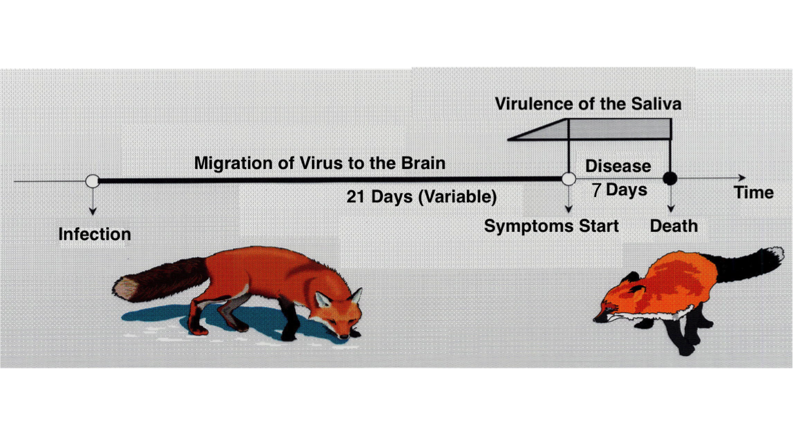

```{r libraries, results='hide', message = FALSE, echo = FALSE,  warning = FALSE}

#install.packages("tidyverse")
#install.packages("readxl")
#devtools::install_github("gadenbuie/xaringanExtra")
#install.packages("fontawesome")


library(dplyr)
library(leaflet)
library(readxl)
library(xaringanExtra)
library(fontawesome)
library(icons)
library(DT)
library(htmltools)
library(htmlwidgets)

knitr::opts_chunk$set(message=FALSE, warning=FALSE, hiline=TRUE)


xaringanExtra::use_xaringan_extra(include = c("panelset", "tile_view", "share_again", "use_broadcast"))

xaringanExtra::style_share_again(share_buttons = c("twitter", "linkedin", "pocket"))


xaringanExtra::use_extra_styles(
  hover_code_line = TRUE,         #<<
  mute_unhighlighted_code = TRUE  #<<
)


```


background-image: url(images/rabies_retreat.png)
background-position: top right
background-size: contain
class: middle, left

# `r rmarkdown::metadata$title`

## `r rmarkdown::metadata$author`


### `r rmarkdown::metadata$date`


---
class: middle, left

# About me

.pull-left[

.center[


## Laurie Baker

### Data Science Lecturer

Office for National Statistics<br>Glasgow, Scotland
]]
.pull-right[
### Education

`r icons::fontawesome("globe")` Wabanaki lands in Yarmouth, ME.

`r icons::fontawesome("graduation-cap")` BSc Marine Biology, University of St. Andrews
`r icons::fontawesome("graduation-cap")` Msc Marine Biology, Dalhousie University
`r icons::fontawesome("graduation-cap")` PhD Epidemiology, University of Glasgow


### Research Interests

`r icons::fontawesome("syringe")`  Public Health
`r icons::fontawesome("fish")`  Ecology
`r icons::fontawesome("desktop")` Data Science
`r icons::fontawesome("satellite")` Novel Data Sources

]

.center[
[`r icons::fontawesome("link")` lauriebaker.rbind.io](https://lauriebaker.rbind.io)
[`r icons::fontawesome("twitter")` @llbaker1707](https://twitter.com/llbaker1707)
[`r icons::icon_style(icons::fontawesome("github"), scale = 1)` @laurielbaker](https://github.com/laurielbaker)
]
???

# About Me

* Grew up in Yarmouth, Maine.

* BSc. in Marine Biology at the University of St. Andrews, Scotland

* MSc. in Marine Biology at Dalhousie University, Canada

* PhD. in Epidemiology at University of Glasgow, Scotland

* Head of Faculty, Data Science Campus, Office for National Statistics


???

---
# Overview

.pull-left[
### Vaccination planning for a wildlife disease


```{r, echo=FALSE, out.width=510, fig.align='center', fig.cap="Map marked with vaccination planning sites"}


```


]

.pull-right[
### Vaccination planning for Covid-19


```{r, echo=FALSE, out.width=480, fig.align='center', fig.cap="Map of Côte d'Ivoire showing estimated travel time walking."}

knitr::include_graphics("images/walk_travel_health.png")

```

]

???

In this talk I'm going to talk about two very different vaccination contexts: vaccination planning for a wildlife disease. 

---
# Background

* Only two diseases have been eliminated worldwide: small pox and rinderpest.


```{r, echo=FALSE, out.width=1050, fig.align='center', fig.cap="Patient's leg with small pox. Cattle that have died from rinderpest"}

knitr::include_graphics("images/small_pox_rinderpest.PNG")

```


* Mass vaccination can greatly reduce the burden of vaccine-preventable diseases.

* However it is unclear how long vaccination must operate to eliminate infection.

---
# Rabies

* Rabies is a deadly disease that kills over 59,000 people each year.
* An RNA lyssavirus that causes encephalitis in a large range of mammals.

```{r, echo=FALSE, out.width=750, fig.align='center', fig.cap="Map of the world with main rabies animal hosts pictured."}

knitr::include_graphics("images/rabies_hosts.jpg")

```


???

* Red fox is the primary reservoir in Europe

---
# Spread of Rabies in Foxes


```{r, echo=FALSE, out.width=800, fig.align='center', fig.cap="Tidy Data."}


```

---
# Foxes

* Most widespread terrestrial carnivore in Europe
* Territorial with high population turnover: 
  * Most foxes live on average 4 years. 
  * Large birth pulse where the population doubles. 


```{r, echo=FALSE, out.width=750, fig.align='center', fig.cap="Rabies cycle in foxes."}



```

???

* Most widespread terrestrial carnivore in Europe
* Territorial with high population turnover: 
  * Most foxes live on average 4 years. 
  * Large birth pulse where the population doubles. 


---
# Vaccine Deployment

.left-column[
```{r, echo=FALSE, out.height=580, out.width = 700, fig.align='center', fig.cap="Animation showing distribution of vaccines."}

knitr::include_graphics("images/western_europe_vac_cases_oct_2016.gif")

```

]

.right-column[
<br>

```{r, echo=FALSE, out.width=260, fig.align='center', fig.cap="Fixed wing aircraft used to distribute vaccines. Vaccine-loaded chicken head."}

knitr::include_graphics(c("images/chicken_head.jpg", "images/fixed_wing_hungary.jpg"))


```

AKA ["That Time Europe Air-dropped Vaccine-loaded Chicken Heads to Bait Rabid Foxes"](https://www.theatlantic.com/science/archive/2015/12/that-time-europe-air-dropped-vaccine-loaded-chicken-heads-to-bait-rabid-foxes/417951/)

]


???

* Over 2.36 million sq. km vaccinated
* Equivalent to 550,000 soccer fields

Over three decades, vaccine loaded chicken-heads were air-dropped across Europe covering a total of 2.36 million square kilometers, the equivalent of 550,000 soccer fields. 

---
# Study

.left-column[
```{r, echo=FALSE, out.width=590, fig.align='center', fig.cap="Incidence Ratio"}


```
]
.right-column[


]


---
# Findings


```{r, echo=FALSE, out.width=900, fig.align='center', fig.cap="Incidence Ratio"}

knitr::include_graphics("images/incidence_ratio.jpg")


```

---
# Findings

.left-column[


```{r, echo=FALSE, out.width=1000, fig.align='center', fig.cap="Incidence Ratio"}


```

]

.right-column[
* Consecutive and coordinated vaccination is required to rapidly control and eliminate rabies.

* Implementing consecutive vaccination campaign sets to build up and sustain high levels of herd immunity

* Incomplete vaccination (missing campaign sets) compromised time to elimination.

* The same or more effort required to achieve elimination and meet similar timelines.
]


???

* Consecutive and coordinated vaccination is required to rapidly control and eliminate rabies.

* Missing Campaigns

Overall we recommend (i) prioritizing ORV campaign sets following the birth pulse, i.e. in autumn, if resources are limited; (ii) 

* Implementing consecutive vaccination campaign sets to build up and sustain high levels of herd immunity;

By contrast, incomplete vaccination (missing campaign sets) compromised time to elimination, with the same or more effort required to achieve elimination and meet similar timelines. It is, therefore, important that policymakers commit to the full elimination timeline and strive to maintain comprehensive coverage to eliminate persistent foci and prevent further costs.
We found that consecutive and coordinated vaccination across geographical regions is required to rapidly control and eliminate rabies

---
class: inverse, center, middle
# Covid-19 Vaccination Planning

---

# Vaccination Sites in Lewiston Auburn

```{r vaccines, eval = TRUE, echo = FALSE}

vac_loc <- read_xlsx("../data/LA_vaccination_locations.xlsx")


DT::datatable(vac_loc, 
              options = list(
                paging = TRUE,
                pageLength =  5 
                           ),
              height = 500
              )
```

**Source:** [www.maine.gov/covid19/vaccines/vaccination-sites](https://www.maine.gov/covid19/vaccines/vaccination-sites)
???

---
# Vaccination Bates

`r fontawesome(name = "question-circle")` What might influence someone's decision of where to get vaccinated?

```{r, echo = FALSE}
iconset1 <- awesomeIconList(
   "Pharmacy" = makeAwesomeIcon(text = fa("syringe"), markerColor = "orange"),
   "Health Care Center" = makeAwesomeIcon(text = fa("syringe"), markerColor = "lightred"),
   "Mobile Vaccination Unit" = makeAwesomeIcon(text = fa("syringe"), markerColor = "red")
)

labels <- sprintf(
  "<strong>%s</strong><br/>Public OR Patients Only: %s<br/>Vaccinates ages 16 and 17+: %s",
  vac_loc$Name, vac_loc$`Public OR Patients Only`, vac_loc$`Vaccinates ages 16 and 17+`
) %>% lapply(htmltools::HTML)

```


```{r first-leaflet-map1f, eval = TRUE, echo = FALSE, out.width = 1000}
leaflet(data = vac_loc) %>%
  setView(lng = -70.2022, 
          lat = 44.1057, 
          zoom = 14) %>%
  addProviderTiles(providers$OpenStreetMap) %>%
  addAwesomeMarkers(~Longitude, 
                    ~Latitude, 
                    icon = ~iconset1[as.factor(Type)],
                    popup = ~labels)
```


---
# Open Data Healthsites Viewer

<iframe src="https://andysouth.shinyapps.io/healthsites_viewer/" width="1016" height="516" frameBorder="0"></iframe>

???

Open and up-to-date data is crucial to plan these efforts. With afrimapr we've been working closely with healthsites.io and other open mapping efforts to gather and visualise the data that is needed.

---
# Health Accessibility in Côte d'Ivoire

```{r, echo=FALSE, out.width=650, fig.align='center', fig.cap="Map of Côte d'Ivoire showing estimated travel time walking."}

knitr::include_graphics("images/walk_travel_health.png")

```
Travel Time in minutes
???
Remote sensing and other open data sets can help to approximate health accessibility in a "physical sense". 

But there are other complex and social economic factors that we are often missing.

The people who are best placed to answer these questions and devise a strategy are those communities who are closest to the issue.

---
# Afrimapr tutorials

<iframe src="https://andysouth.shinyapps.io/intro-to-spatial-r/" width="1016" height="516" frameBorder="0"></iframe>
[Afrimapr Tutorials](https://andysouth.shinyapps.io/intro-to-spatial-r/)

???
With Afrimapr I am helping to develop tutorials to teach communities the operational programming tools to answer important questions. 


---
class: center
## Computer science can provide us with the tools


```{r, echo=FALSE, out.width=650, fig.align='center', fig.cap="Data Analysis assembly line: Wrangle, Visualise, Model"}

knitr::include_graphics("images/tidydata_5.jpg")

```

Artwork by @allison_horst

## But we bring the

--

----

.left-col[.center[
`r icons::icon_style(icons::fontawesome("globe"), scale = 2)`
### Context
]]

--

.center-col[
.center[
`r icons::icon_style(icons::fontawesome("users"), scale = 2)`
### Experience
]]

--

.right-col[.center[
`r icons::icon_style(icons::fontawesome("lightbulb", style = "solid"), scale = 2)`
### Knowledge
]]

---
# What excites me about Bates

???

- Work with students at intersection of different topics
- And on important issues in Maine. 
- I'm very excited to hear about the questions that you are excited about exploring

---

class: center, middle

# Thanks!


```{r, echo=FALSE, out.width=400, fig.align='center', fig.cap="Cake with fox and chicken heads on it"}

knitr::include_graphics("images/fox_cake.jpg")

```


Slides created via the R package [**xaringan**](https://github.com/yihui/xaringan).

The chakra comes from [remark.js](https://remarkjs.com), [**knitr**](http://yihui.name/knitr), and [R Markdown](https://rmarkdown.rstudio.com).


